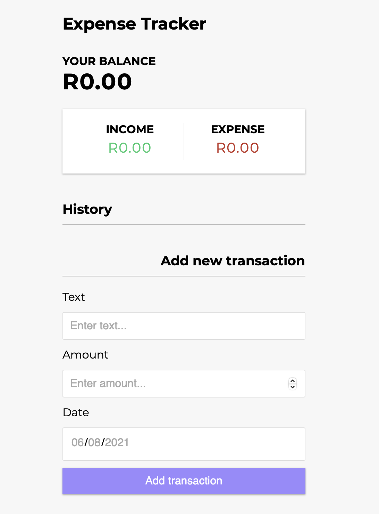

<h1 align="center">💸 Expense Tracker 💸</h1>

<p align="center"> Made in React, constructed with create-react-app, state managed by Context API. </p>
<p align="center">
  
  <a href="#" target="_blank">
    
  </a>
  <a href="https://twitter.com/mrginolee" target="_blank">
    
  </a>
</p>

<h2 align="center">💰 <a href="https://ginoleeswan.github.io/expense-tracker-react/">See Live</a> 💰</h2>

<p align="center">
  <a href="https://ginoleeswan.github.io/expense-tracker-react/">
    
  </a>
</p>

<h2 align="right">📖 &nbsp; Lessons Learned</h2>

<div align="right">

&nbsp; This project started with scattered peices of state in class based components.\
&nbsp; I used **Context API** to effectively manage global state between all the components in the app.\
&nbsp; This approach to **state management** is much cleaner as state is easily available to any component and doesnt have to be passed down.

&nbsp; This project also gave me a good grasp of array **methods** (map) to list the transactions.

</div>

## 🔮 &nbsp; Future Features

- 💱 &nbsp; Currency Converter
- 🏦 &nbsp; Multiple Accounts
- 📈 &nbsp; Charts and tables to show spending/earning trends
- 🏷️ &nbsp; Product/Service Catagories

<h2 align="right">🚀 &nbsp; Deployment</h2>
<div align="right">

Deployed with [Github Pages](https://ginoleeswan.github.io/expense-tracker-app)

</div>

## 🔨 &nbsp; Get Started

From your command line, first clone this repo:

```sh
# Clone this repository
$ git clone https://github.com/ginoleeswan/expense-tracker-react/

# Go into the repository
$ cd expense-tracker-react

# Remove current origin repository
$ git remote remove origin
```

### Install

```sh
npm install
```

### Usage

```sh
npm run start
```

### Run tests

```sh
npm run test
```

<div align="right">

## ✍️ &nbsp; Author

👤 **Gino Swanepoel**

&nbsp; Twitter: [@mrginolee](https://twitter.com/mrginolee)\
 &nbsp; Github: [@ginoleeswan](https://github.com/ginoleeswan)\
 &nbsp; LinkedIn: [@ginoswanepoel](https://linkedin.com/in/ginoswanepoel)

</div>

## ❤️ &nbsp; Show your support

Give a ⭐️ if this project helped you!
